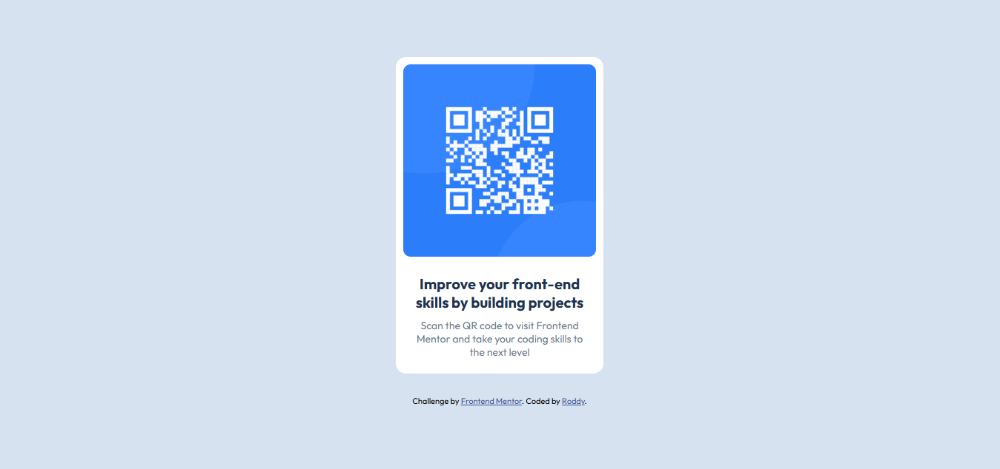

# Frontend Mentor - QR code component solution

This is a solution to the [QR code component challenge on Frontend Mentor](https://www.frontendmentor.io/challenges/qr-code-component-iux_sIO_H). Frontend Mentor challenges help you improve your coding skills by building realistic projects. 

## Table of contents

- [Overview](#overview)
  - [Screenshot](#screenshot)
  - [Links](#links)
- [My process](#my-process)
  - [Built with](#built-with)
  - [What I learned](#what-i-learned)
  - [Continued development](#continued-development)
  - [Useful resources](#useful-resources)
- [Author](#author)
- [Acknowledgments](#acknowledgments)

## Overview

### Screenshot

### Links

- Solution URL: [Click here for solution]([https://your-solution-url.com](https://github.com/Roddy470/qr-code-component))
- Live Site URL: [Click to check live site](https://qr-code-io.netlify.app)

## My process

### Built with

- Semantic HTML5 markup
- CSS custom properties

### Useful resources
- [Google Fonts](https://www.example.com) - I used this to get the particular fonts needed for this challenge.

## Author
- Frontend Mentor - [@Roddy470](https://www.frontendmentor.io/profile/Roddy470)
